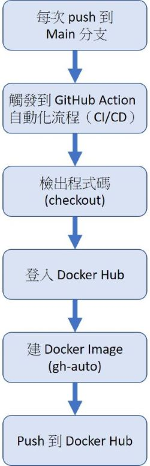

# 2025cloud
雲原生作業 4

##  描述如何透過 docker build 與  docker run 達到作業要求
### 建立 Docker Image

請在此專案資料夾中執行以下指令：

```bash
docker build -t cyjginny/2025cloud:v1 .
docker build -t cyjginny/2025cloud:v2 .
```
### 執行 Container Image（docker run）

建構完成後，請使用以下指令來執行容器：
```bash
docker run -d -p 8080:80 cyjginny/2025cloud:v1
docker run -d -p 8081:80 cyjginny/2025cloud:v2
```
### 確認是否執行成功
1. 查看目前執行中的容器：
```bash
docker ps
```
2. 開啟瀏覽器：
- http://localhost:8080 （對應 v1）
- http://localhost:8081 （對應 v2）


## 圖文說明目前專案自動化產生 Container Image 以及 Tag 的選擇的邏輯
1. 自動化產生 Container Image 的邏輯 :採用 GitHub Actions 作為 CI 工具，當下列觸發條件發生時，會自動執行建置流程
- 觸發條件 1：主分支有任何變更（例如修改 Dockerfile 或 app.py），會觸發自動建置與推送流程
- 觸發條件 2：若有人對 main 發 PR，也會執行 Build 檢查流程，驗證是否能成功建構 Image
2. 自動化流程
```bash
    A[Push to main branch] --> B[Trigger GitHub Action]
    B --> C[Checkout code]
    C --> D[Login to DockerHub]
    D --> E[Build Docker Image]
    E --> F[Push to DockerHub]
```

3. 建置流程（build-and-push）
GitHub Actions 中的 docker-build.yml 指定以下步驟：
- checkout (檢出程式碼)：抓取最新的程式碼，把 GitHub repo 的程式碼下載到 runner 裡。
- Trigger (觸發條件) : 每當有程式碼被 push 到 main 分支 時，這個 GitHub Action 就會被觸發。
- docker login (登入 Docker Hub)：使用 GitHub Secrets 中儲存的帳號密碼登入 Docker Hub，才能 Push Image。
- docker build (建構 Docker 映像) ：使用 Dockerfile 建立 image，並指定 tag 為 gh-auto，表示為 GitHub 的自動建構版本。
- docker push (推送到 Docker Hub)：把剛剛建構好的映像（gh-auto）推送到 Docker Hub 的指定 repository 中。


##  說明目前 Image Tag 設計邏輯
1. Tag 名稱與用途
- gh-auto : 表示為 GitHub Action 自動產生的版本
-     觸發行為 : 每次 push 到 main 分支時都會自動更新，用於開發測試、CI 驗證等非正式環境。
-     建構邏輯 : GitHub Action 自動啟動 
- v1, v2 : 表示為手動建構並推送的穩定版本，通常用於正式發佈與部署
-     觸發行為 : 手動執行 docker build + docker push
-     建構邏輯 : 本地建構並推送
-     這類型 Tag 不會自動被覆蓋，適合版本追蹤與 rollback 。
